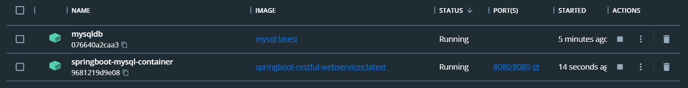
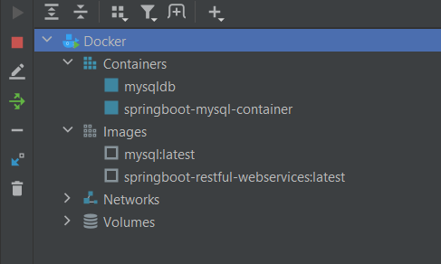
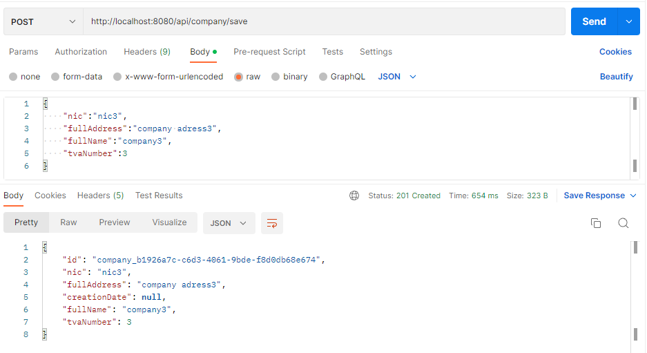
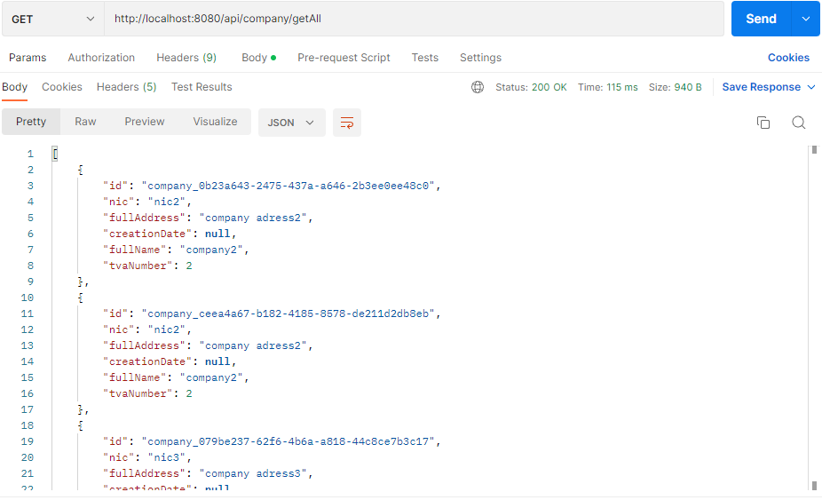
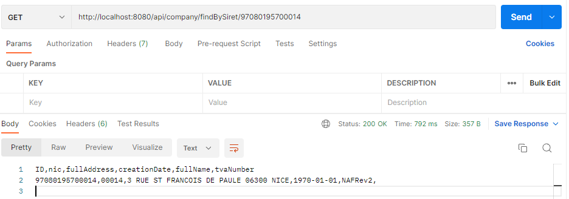
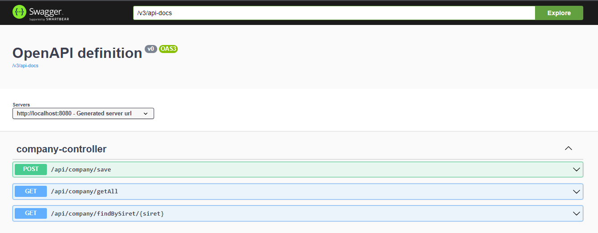
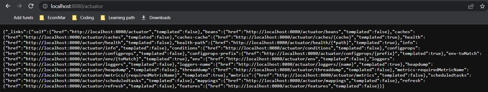

# Company-Service Application

Company Service is an application that retrieve the company information for all
businesses defined by the SIRET number

## How to clone the project ?

Go to [Github Repository](https://github.com/AkramYOUBI/company-service) copy the link and use following command in a specified folder to clone the project.
```bash
git clone https://github.com/AkramYOUBI/company-service
```
## How to run the project in you local machine ?

```bash
cd <your-repository-path>
```
then run this command:

```bash
mvn spring-boot:run
```
## How to run the application in a docker container ?

### Deploy Spring Boot MySQL Application to Docker
#### 1. Deploy MySQL Image in a Container
##### Step1: Pull MySQL Image
```bash
docker pull mysql
```
##### Step 2: Create a docker network to communicate Spring boot application and MySQL database
```bash
docker network create springboot-mysql-net
```
##### Step 3: Run MySQL image in a docker container in the same network
```bash
docker run --name mysqldb --network springboot-mysql-net -e MYSQL_ROOT_PASSWORD=root -e MYSQL_DATABASE=companydb -d mysql
```
##### Step 4: Access the MySQL database in a container
```bash
docker exec -it mysqldb bash
```
```bash
mysql -u root -p
```
for the password type: "root"

#### 2. Deploy Spring Boot Application in a Docker Container
##### Step 1: Build the project
```bash
mvn clean package
```
##### Step 2: Build the project
Once maven builds success, go target folder, and you will be able to see the (.jar) file.
##### Step 3:Build Docker Image from Dockerfile:
```bash
docker build -t springboot-restful-webservices .
```
##### Step 4: Run a docker image in a docker container in the same network
```bash
docker run --network springboot-mysql-net --name springboot-mysql-container -p 8080:8080 springboot-restful-webservices
```
## Test The Application:

### 1- Verification in docker Desktop


#### 1.1- Verification in intellij interface


### 2- Save API


### 3- FindAll API


### 3- Find By Siret API


### 4- Swagger


### 5-Actuator

